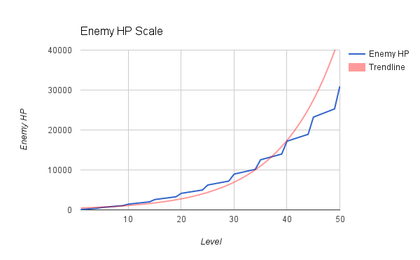

#Dwarven Defender!

###GA WDI-LDN-16 - Project 1
#####[Play it here!](https://glacial-hamlet-1798.herokuapp.com/ "Here!")

Dwarven Defender is a clicker type game inspired by titles such as 'Cookie Clicker' 
and 'Clicker Heroes'.

The objective is to kill the enemy goblin by repeatedly tapping or clicking on it.
Upon killing an enemy, a new goblin will spawn. The game can be played indefinatly, 
with the enemies HP and damage scaling exponentially as you progress.

#####Gameplay

1. Each new enemy starts on the right of the screen and propressivly moves towards the player.
2. Don't let the enemy get too close! It will damage the player when it gets close.
3. Tap / click on the enemy goblin to deal damage to it!
4. When an enemy is killed, it will drop some gold for the player and a new enemy spawns.
5. Gold is used to hire henchmen. Please see the 'henchmen' section for more information.
6. Every 5 kills will result in a level up! Each level gives the player 5 points to upgrade.
7. If the player reaches 0 HP, the game is over and you see your game statistics.

#####Upgrades

Every level rewards the player with 5 upgrade points. These points are used to upgrade
various aspects of your hero.

* Attack      Increased click damage by 1 per purchase. This also affects henchmen.
* Defense     Increased resistance to enemy attacks by 1 per purchase.
* Speed       Increased chance to dodge by .1%. Dodge will avoid all damage from a single attack.
* Presence    Decreases the enemies movement speed by .1% per purchase.
* Agility     Increased critical hit chance by .1% per purchase (crits do x10 damage).
* Vitality    Increased hero health by 10HP per purchase. Choosing this also fully heals your hero!

#####Henchmen

Henchmen aid the player by clicking on enemies for you! Hencmen are hired with gold that
the player automatically collects from fallen enemies. Hencmen are not mutually exclusive, 
so you can have one or more henchmen active. The current henchmen are:

* Darius the lame    Darius is a n00b adventurer who lazily clicks on the enemy once per second.
* Alaris the Meh     Alaris is an average warrior capable of clicking on the enemy 5 times per second.
* Terna the cool     Terna is a veteran goblin hunter that clicks on the enemy 10 times per second.

#####Progression

Dwarven Defender is a game that goes on forever as long as the player is alive. This is acomplished
by having an exponential scale that increases the enemies HP and damage that is based on the current
level and a modifier of x1.2. 

The player will reach the next level every 5 enemy kills, and the modifier is multiplied by itself
every 5 levels. To stay competative, the player must upgrade and hire henchmen to survive. 

